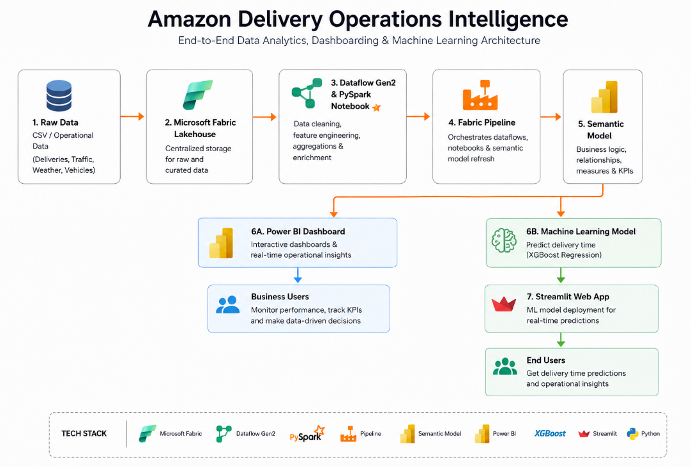
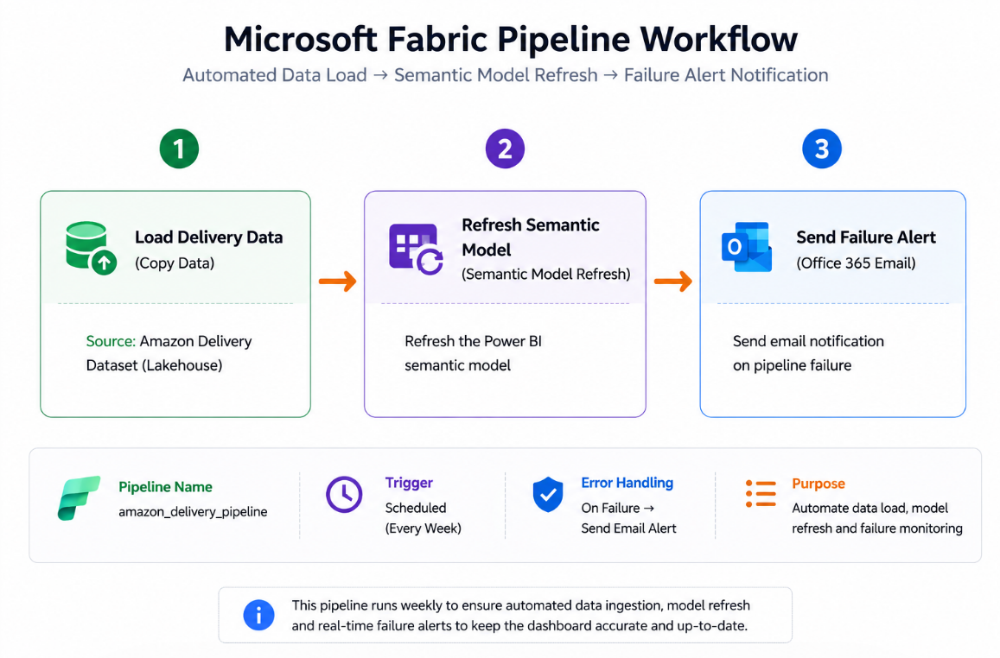
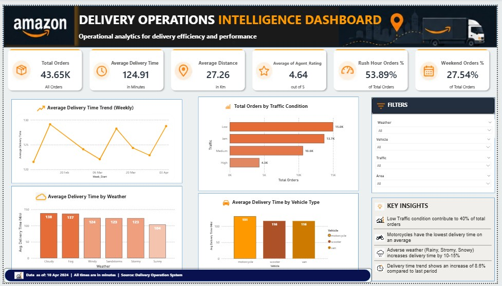
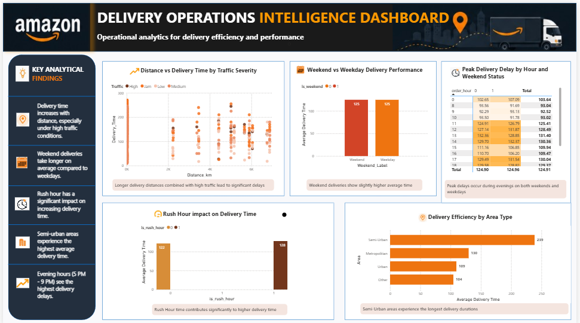

# Amazon Delivery Operations Intelligence Dashboard

An end-to-end Data Analytics, Business Intelligence, and Machine Learning project built using Microsoft Fabric, Power BI, PySpark, Scikit-learn, and Streamlit to analyze and predict Amazon delivery operations performance.

This project focuses on operational intelligence, delivery performance analysis, automated workflows, and delivery time prediction using the Microsoft Fabric ecosystem.

---

# Project Overview

The objective of this project is to analyze delivery operations and identify the factors affecting delivery efficiency such as traffic conditions, weather, distance, rush hours, and area type.

The solution integrates:

- Data Engineering
- Data Analytics
- Business Intelligence
- Machine Learning
- Workflow Automation

into a single end-to-end analytics solution.

---

# Business Objectives

- Analyze delivery performance trends
- Identify operational bottlenecks
- Understand weather and traffic impact
- Analyze rush hour and weekend delivery behavior
- Predict delivery time using Machine Learning
- Build automated reporting workflows using Microsoft Fabric

---

# Tech Stack

| Technology | Purpose |
|------------|---------|
| Microsoft Fabric | Data Engineering & Pipeline |
| Lakehouse | Centralized Data Storage |
| Dataflow Gen2 | Data Transformation |
| PySpark | Feature Engineering |
| Power BI | Dashboard & Visualization |
| Semantic Model | Business Intelligence Layer |
| Python | Data Processing |
| Scikit-learn | Machine Learning |
| Streamlit | Web Application Deployment |

---

# Solution Architecture



---

# Microsoft Fabric Pipeline Workflow



The Microsoft Fabric Pipeline automates:

- Data ingestion
- Semantic model refresh
- Failure notification workflow

---

# Data Engineering Workflow

```text
Raw Delivery Dataset
        ↓
Microsoft Fabric Lakehouse
        ↓
Dataflow Gen2 / PySpark Notebook
        ↓
Microsoft Fabric Pipeline
        ↓
Semantic Model
       ↙          ↘
Power BI Dashboard   Machine Learning Model
                                ↓
                       Streamlit Web App
```

---

# Data Preprocessing & Feature Engineering

The dataset was cleaned and transformed using PySpark and Dataflow Gen2 in Microsoft Fabric.

### Data Cleaning Performed

- Null value handling
- Duplicate removal
- Data type corrections
- Column standardization

### Feature Engineering Performed

- Rush Hour Identification
- Weekend Detection
- Order Hour Extraction
- Pickup Hour Extraction
- Distance Calculation
- Operational Time Analysis

---

# Machine Learning Model

A Delivery Time Prediction model was developed using Scikit-learn and deployed using Streamlit.

### Model Features

- Agent Age
- Agent Rating
- Weather
- Traffic
- Vehicle Type
- Area
- Distance
- Order Hour
- Pickup Hour
- Rush Hour
- Weekend Indicator

---

# Power BI Dashboard

The dashboard was designed to provide operational insights and delivery intelligence.

---

# Dashboard Page 1 — Executive Overview

This page provides high-level operational KPIs and delivery performance insights.

### Includes

- Total Orders
- Average Delivery Time
- Average Distance
- Average Agent Rating
- Rush Hour Orders %
- Weekend Orders %
- Weekly Delivery Trend
- Traffic Condition Analysis
- Weather Impact Analysis
- Vehicle Performance Analysis
- Business Insights Panel

### Dashboard Preview



---

# Dashboard Page 2 — Operational Performance Analysis

This page provides deeper analytical insights into delivery operations.

### Includes

- Distance vs Delivery Time Analysis
- Peak Delivery Delay Analysis
- Rush Hour Impact Analysis
- Area-wise Delivery Performance
- Order Hour Trend Analysis
- Operational Bottleneck Analysis

### Dashboard Preview



---

# Key Insights

- Peak delivery delays occur during evening hours
- Traffic congestion significantly impacts delivery performance
- Adverse weather conditions increase delivery delays
- Rush hour periods contribute to operational inefficiencies
- Motorcycles handle the majority of delivery operations
- Semi-urban regions experience longer delivery durations

---

# Live Dashboard

🔗 Power BI Dashboard:  
https://app.fabric.microsoft.com/links/FJLR1RzE37?ctid=880db91c-d2b8-4752-96bb-ec6f76398bf3&pbi_source=linkShare

---

# Live Web Application

🔗 Streamlit Web App:  
https://amazon-delivery-time-prediction-fabric-1.onrender.com

---

# Repository Structure

```text
amazon-delivery-operations-intelligence/
│
├── app/
│   └── app.py
│
├── notebooks/
│   └── 01_data_cleaning.ipynb
│   └── 02_eda_analysis.ipynb
│   └── 03_feature_engineering.ipynb
│   └── 04_model_training_mlflow.ipynb
│
├── models/
│   └── final_streamlit_model.pkl
│
├── dashboard/
│   ├── amazon_delivery_pipeline.png
│   ├── Executive Overiview.png
│   ├── Operational Performance Analysis.png
│   └── workflow.png
│
├── data/
│   └── amazon_delivery.csv
│
├── requirements.txt
├── convert_model.py
├── README.md
└── .gitignore
```

---

# Future Improvements

- Real-time delivery tracking
- Geo-spatial route optimization
- Live streaming analytics
- Advanced forecasting models
- Automated alert systems
- Dynamic operational monitoring

---

# Author

Naaz

Computer Science Graduate.

---
